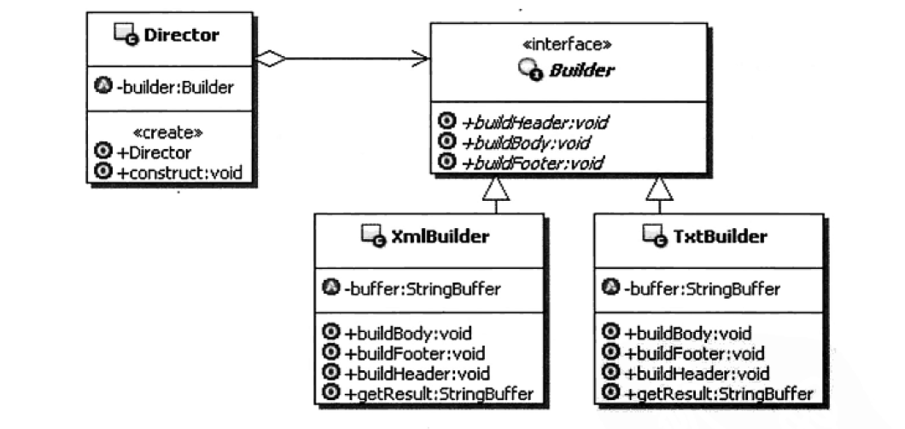

### 构建模式
1. **定义**  
将一个复杂对象的构建与它的表示分离，使得同意的构建过程可以构建不同的表示。  
实现具体的操作与组合的分离
2. **UML**  
  

### Link
- [源码地址](https://github.com/dzhai/Demo/tree/master/Designpattern/src/com/d/builder)
- [http://blog.csdn.net/m13666368773/article/details/7689164](http://blog.csdn.net/m13666368773/article/details/7689164)