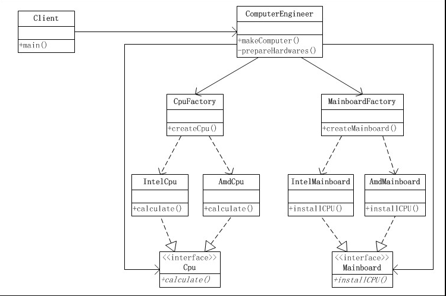

### 抽象工厂
1. 定义
提供一个创建相关或相互依赖对象的接口，而无需指定具体的类。   
**简单工厂--> 工厂方法 -->抽象工厂 **

2. UML  

####Link
- [源码地址](https://github.com/dzhai/Demo/tree/master/Designpattern/src/com/d/factory/abstractfactory)
- [http://blog.csdn.net/m13666368773/article/details/7677374](http://blog.csdn.net/m13666368773/article/details/7677374)