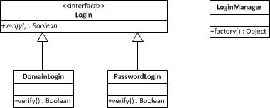

### 简单工厂
1. 温故知新
简单工厂模式是类的创建模式，又叫做静态工厂方法（Static Factory Method）模式。简单工厂模式是由一个工厂对象决定创建出哪一种产品类的实例。

2. UML

####Link
- [源码地址](https://github.com/dzhai/Demo/tree/master/Designpattern/src/com/d/factory/simplefactory)
- [http://blog.csdn.net/m13666368773/article/details/7676371](http://blog.csdn.net/m13666368773/article/details/7676371)