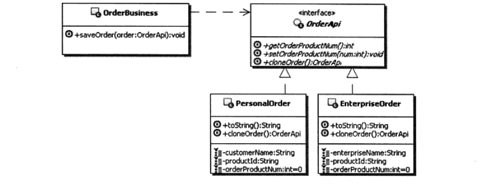

### 原型模式
1. **定义**  
用原型实例指定创建对象的种类，并通过拷贝这些原型创建新的对象。  
谁的对象 谁复制
2. **UML**  
  

### Link
- [源码地址](https://github.com/dzhai/Demo/tree/master/Designpattern/src/com/d/prototype)
- [http://blog.csdn.net/m13666368773/article/details/7690559](http://blog.csdn.net/m13666368773/article/details/7690559)